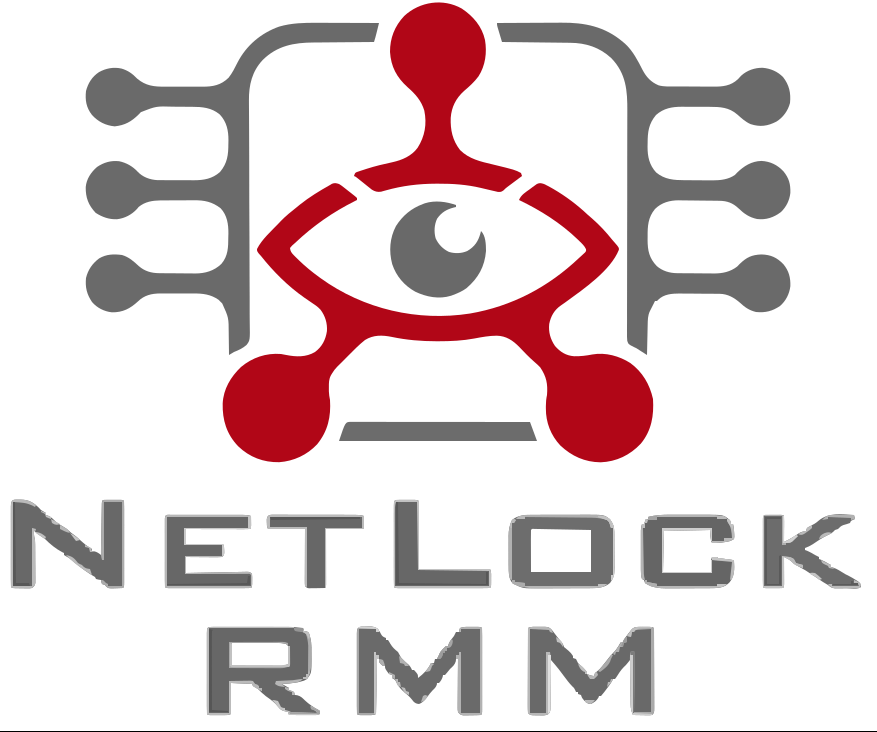
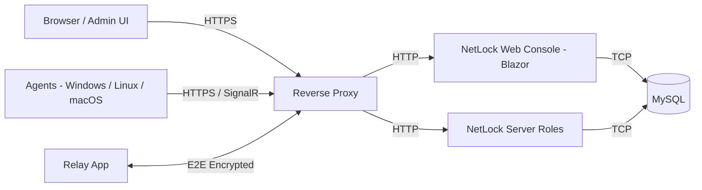

# NetLock RMM

### Open-Core Remote Monitoring & Management for MSPs and IT Teams

---

> **⭐ If NetLock RMM is useful to you, please star this repo — it helps others discover the project!**

## What is NetLock RMM?

**NetLock RMM** is an **open-core** Remote Monitoring & Management platform built for **Managed Service Providers** and **internal IT teams**, with a strong focus on **cybersecurity**. Lightweight cross-platform agents stream telemetry to a self-hostable server so you can monitor, manage and remotely support your entire fleet from a single web console.

Whether you run NetLock RMM in the cloud, on-premises, in Docker / Kubernetes, or in fully isolated / air-gapped environments — and whether you manage ten endpoints or ten thousand — NetLock RMM gives you the visibility, automation and remote tooling that modern IT operations demand, without per-seat license fees.

Built on **C# / .NET, Blazor, ASP.NET Core and SignalR** for performance, scalability and a native cross-platform agent experience.

🎬 **[Watch the Web Console Demo](https://netlockrmm.com/assets/hero-demo-MVb7uUdN.webm)**

---

## 🧭 Our Story & Philosophy

NetLock RMM is **not** a "vibe-coded" weekend project and it is definitely not AI slop.

- **2021** — The very first NetLock RMM prototype was built as a proof of concept.
- **Early 2022** — Full-scale development of NetLock RMM officially started.
- **End of 2024** — The current open-source version of NetLock RMM was publicly released.

Years of real engineering, real architectural decisions and real production usage went into this platform long before the current AI hype cycle. We are aware that AI will permanently change how software is built, and we do adopt it where it sensibly accelerates our work — but **every security-relevant and architectural decision in NetLock RMM is designed, reviewed and implemented by humans, by hand, without AI**. That is a hard rule for us, and it is not negotiable.

### 🔓 Open Core — and Why It Changed

We made NetLock RMM open for one simple reason: **maximum transparency and trust**. An RMM agent runs with high privileges on every endpoint it touches — you should never have to take a vendor's word for what that agent does. With NetLock RMM you can read the source of the core, audit the network traffic, verify that there is no hidden telemetry, and convince yourself (and your customers, and your auditors) that the platform behaves exactly the way it claims to.

NetLock RMM originally launched **fully under the AGPL**, because transparency matters to us. Over time, though, we watched startups copy the project outright — and increasingly use AI to re-implement its logic in another language to sidestep the license entirely, profiting from the work without giving anything back.

So in **2026** we made a deliberate decision to move to an **open-core model**: the **core stays open under the AGPL**, but not every feature's source is published. Anyone who wants to can still build on the open core, and fair pricing stays central — with the **v3** release, the cloud version actually became *cheaper*.

**Want to audit the security of NetLock RMM against the full, current codebase?** If you are a **genuine security-audit / pentesting company or a government institution**, we gladly **invite you to perform audits on the complete and up-to-date codebase, on-site within our company**. Transparency does not stop at the open core — it extends to giving qualified auditors real, verifiable access to everything that matters.

Practically, this means we now publish **selected parts of the codebase** to this public repository — and **further parts on request** — rather than mirroring everything in real time. Our internal codebase has evolved very significantly since the early open-source days, and curating what we publish lets us **harden security** while still giving the community, customers and auditors a real, verifiable view into how NetLock RMM works. 

None of this changes our mission: we want to be the **fairest and still most transparent RMM vendor on the market** — with **very fair, very low pricing**, **solid engineering**, **first-class support**, and all of it **built and run from Germany** 🇩🇪.

Transparency is still how we earn — and keep — your trust.

> 📖 Read the full reasoning behind this decision in the founder's story: **[netlockrmm.com/company/about](https://netlockrmm.com/company/about)**

---

## ✨ Features at a Glance

**350+ ready-made sensors** &nbsp;•&nbsp; **85+ features** &nbsp;•&nbsp; **100+ granular permissions** &nbsp;•&nbsp; **53 report templates** &nbsp;•&nbsp; **9 console languages** &nbsp;•&nbsp; **3 platforms** &nbsp;•&nbsp; **0 hidden telemetry**

NetLock RMM is a full-stack platform — monitoring, automation, remote access, patching, software deployment, ticketing, reporting and security tooling all in one console. Here's the high-level map:

| Category | What You Can Do |
|---|---|
| 🖥️ **Cross-Platform Agents** | **Code-signed** one-click installer for **Windows** (7 → 11 / Server 2012 → 2025), **Linux** (Ubuntu, Debian, RHEL, CentOS Stream, Fedora, Proxmox) and **macOS** (Ventura → Sequoia). Both **x64 and ARM64**. Agents auto-update and self-heal. |
| 🧩 **Multi-Tenancy** | **Unlimited** tenants, locations and groups with full isolation — no per-tenant fees. Perfect for MSPs juggling many customers from one console, with unified cross-tenant reporting. |
| 👥 **Users, Roles & SSO** | **100+ granular permission settings**, importable role templates, **two-factor authentication (TOTP)** and **Single Sign-On** (SAML & OIDC) via **Keycloak, Entra ID, Auth0 or Okta**. Per-user auth modes (password / SSO / both / enforced 2FA). |
| 🛡️ **Flexible & Scalable Architecture** | Run everything on a single box, or split the **8 server roles** (Comm, Update, Trust, Remote, Notification, File, LLM, Relay) across machines for HA. **Fallback servers** per role and full **reverse-proxy** support. A 2-core / 8 GB server handles **5,000+ devices**. |
| 🚀 **Streamlined Setup** | Server and Web Console ship as a standalone **Kestrel**-based binary — no Apache, no IIS, no fuss. Run it on bare metal, in Docker or in Kubernetes, with a custom **1-click Install Builder** (GPO / Intune / MDM scripts). |
| 🛠️ **Powerful Remote Tools** | Real-time **remote shell** (PowerShell / Bash / Zsh / Python3, classic + VT100/ANSI, run-as-user, bulk execution), **file browser**, **task manager**, **service manager**, **remote registry**, **Windows Event Log viewer**, **Wake-on-LAN** and instant **shutdown / reboot**. |
| 🖱️ **Remote Screen Control** | TeamViewer-grade remote control for **Windows & Linux**. **H.264 adaptive streaming**, multi-monitor & virtual-display switching, multi-operator session switching (incl. RDP/RDS), unattended + attended access, user chat, **Ctrl+Alt+Del**, **session recording**, keystroke injection — with an optional **2FA gate** on remote actions. |
| 🔗 **E2E-Encrypted Relay** | Tunnel **RDP, SSH, MySQL, VNC or any TCP service** through the **Relay App** — no port forwarding, no exposed ports. Use your own tools (DBeaver, native RDP, PuTTY) or reach internal web apps and LAN devices through a jump host. |
| 🎧 **Custom User Tray Icon & Chat** | Deploy a white-label tray icon with custom logo, interface texts and action buttons (open URL / run command), a built-in **support chat**, and an optional **end-to-end-encrypted end-user AI chat**. |
| 🧾 **Inventory & Hardware Monitoring** | Software & hardware inventory, CPU, RAM, drives, network adapters, drivers, services, scheduled tasks, logon history and more — across Windows, Linux and macOS. |
| 📡 **Monitoring & Sensors** | **350+ ready-made sensors** plus **custom RegEx script sensors** (PowerShell / Bash / Zsh / Python3). Utilization, process, service, ping, Windows Event Log, **SNMP (v1 / v2c / v3)** and **port-scanner** sensors, with counter-based triggers, spam-prevention and auto-reset. **28 monitored vendors** out of the box. |
| 🌐 **Website & Uptime Monitoring** | Server-side HTTP/HTTPS checks with **SSL-expiry** (30/14/7/3-day) alerts, **DNS** record monitoring, content & **defacement** detection, response-time history (24h / 7d / 30d) and a full **incident timeline** with smart root-cause detection. |
| ⚙️ **Automation & Jobs** | **Jobs** for scheduled PowerShell, Bash, Zsh and Python scripts with retry logic, timeouts and a shared script library. Attach scripts to sensors for **self-healing** and escalation. Import community scripts. |
| 📜 **Policy Management** | Auto-assign policies by tenant, location, group, domain, IP or device name with a clear **most-specific-wins** hierarchy. Define and enforce antivirus, notification, sensor, patch and job policies. |
| 🩹 **Patch Management** | Patch **Windows, Linux, macOS & Docker** — plus third-party apps via **winget, Chocolatey & Flatpak**. Approval workflows, **severity-based SLA windows**, deployment rings, Patch-Tuesday-relative scheduling, smart maintenance windows, reboot handling and **automatic rollback** on failure-rate thresholds. |
| 📦 **Software Deployment & App Hub** | Deploy from a catalogue sourced from **Winget, Flathub, Chocolatey** or custom **scripts**. A 4-step wizard targets devices/groups/locations/tenants with run modes, scheduling, retries and per-device status & attempt history. |
| 🛡️ **Application Control** *(Windows)* | In-house **default-deny allowlisting** engine matching path, version info, **SHA256/SHA512 hashes** and certificate details — approve pending apps straight into allow rules. |
| 🔌 **USB Device Control** *(Windows)* | Allowlist devices by vendor ID, product ID, serial or device class, with approval scopes from a single device up to global, across **10 recognised device classes**. |
| 🛡️ **Antivirus & Firewall** | Manage **Microsoft Defender Antivirus**, monitor firewall status, and drive the **Linux UFW Firewall Manager** (policy-based with drift re-apply) — all enforced through policies. |
| 🎫 **Ticketing, Helpdesk & CRM** | Optional helpdesk module with multi-department **IMAP/SMTP**, **SLA engine**, time tracking (auto + manual, billable rounding), labels, templates, per-department webhooks, a native **CRM** with tenant linkage and a statistics dashboard. |
| 📑 **Reports** | **53 pre-built templates** plus a visual query builder and raw-SQL "God Mode". Metric / chart / table / text widgets, brand templates, **6 schedule frequencies** and export to **PDF, HTML, CSV or JSON** via download, email or webhook. |
| 🧩 **Custom Fields & Dashboards** | Build whole device-page tabs from manual input, job results (RegEx-parsed) or SQL — with action buttons. Per-user **custom dashboards** with drag-and-resize chart & table panels on a 12-column grid. |
| 📊 **Dashboards & Event Viewer** | Centralised dashboards with statistics, unread events and a powerful **event browser** with severity-based filtering. |
| 🕵️ **Tamper-Evident Auditing** | Append-only, immutable **audit log** covering 10 action categories across 18 entity types with severity levels, tenant scoping, rich filters and JSON/CSV export. |
| 🤖 **NetLock AI** | OpenAI-API-compatible LLM connector (OpenAI, Claude or self-hosted models) wired into the script editor, remote shell, event-log viewer, ticketing and auditing — with file attachments, streaming markdown and per-tenant token budgets. |
| 🔔 **Event Notifications** | Get alerted via **Email, Microsoft Teams, ntfy.sh, Telegram** or **custom webhooks** with templated variables and priority-based routing. |
| 📁 **Integrated File Server** | Host your favourite scripts and tools directly inside NetLock RMM and reference them from your jobs, with 1-click custom installers per platform. |
| 🗺️ **Device World Map** | Visualise your whole fleet on a map using **bundled, offline GeoIP** — no third-party lookups. |
| 🎨 **White-Label Branding** | Theme every colour, logo and title; brand the tray icon, support chat and screen-control prompts; set a custom login background (image/video) — and share signed white-label themes with the community. |
| 🛠️ **Maintenance Mode** | Manual or scheduled weekly maintenance windows that suppress notifications while you work. |
| 🔏 **Code Signing** | **Every edition — including Community — ships code-signed Windows agents and installers** (x64 & ARM64): SmartScreen-safe, verified-publisher, tamper-evident. |
| 🔐 **Security by Design** | Agent handshake so only authorised agents talk to your server, **Trust Server** supply-chain hash verification, RAM-based encrypted package delivery, Web Console & backend IP restriction, outbound-only agents, full data sovereignty through self-hosting and **end-to-end encryption** for relay connections. **No hidden telemetry — verify it yourself in the source.** |

> Looking for the full feature list? Head over to **[netlockrmm.com/docs/features](https://netlockrmm.com/docs/features)**.

---

## 🏗️ Architecture

NetLock RMM is built on a modular role-based architecture so you can scale individual components independently.

| Component | Technology |
|-----------|------------|
| Web Console | Blazor Server + MudBlazor |
| Server | ASP.NET Core (Kestrel) + SignalR |
| Agents | C# / .NET — Windows, Linux, macOS (x64 & ARM64) |
| Realtime Transport | SignalR over WebSockets |
| Database | MySQL |
| Relay | Standalone end-to-end encrypted tunnel app |

---

## 🎟️ Editions & Members Portal

NetLock RMM is built for **enterprises, MSPs, MSP startups and any organisation** that takes a secure, professional platform seriously. To serve everyone — from a homelab tinkerer to a fully managed service provider running thousands of endpoints — we offer NetLock RMM in three editions, all managed through our **[Members Portal](https://members.netlockrmm.com)**:

| Edition | Hosting | Who it's for | Device limit |
|---|---|---|---|
| 🆓 **Community Edition** | Self-hosted | Homelabs, evaluators, small teams, anyone who wants to try or run NetLock RMM for free. The open-core platform, all core features, no per-seat fees. Community support via [Discord](https://discord.gg/HqUpZgtX4U) and [GitHub Issues](https://github.com/0x101-Cyber-Security/NetLock-RMM/issues). | **Up to 25 devices** |
| 💼 **Self-Hosted Paid** | Self-hosted | Enterprises, MSPs and businesses that want to run NetLock RMM in their own infrastructure but need an SLA-backed professional partner. Includes professional support directly from the maintainers and prioritised handling. | **Unlimited** — no device cap |
| ☁️ **Cloud-Hosted Edition** | Hosted by us | Organisations that want NetLock RMM up and running **without managing any infrastructure**. We handle provisioning, updates, backups, scaling and uptime — you focus on managing your fleet. | **Per-package limit** — pick the tier that fits your fleet |

> 👉 **See the full plan comparison and pricing at [netlockrmm.com/pricing](https://netlockrmm.com/pricing/)**

### Why a Members Portal?

The **[Members Portal](https://members.netlockrmm.com)** is the professional interface between the NetLock RMM community, the businesses that depend on the platform, and us as the maintainers. It's where you manage your subscription and licence, access professional support, run the live demo, and interact with the team in a structured way that scales beyond a Discord channel — **without ever locking the open core behind a paywall**.

The core stays open under the AGPL. The portal exists so that the people who need a professional vendor relationship can have one.

> ⚡ **The Cloud-Hosted Edition is by far the easiest way to deploy and maintain NetLock RMM.** Provisioning, updates, backups and infrastructure are all handled for you — no Docker, no reverse proxy, no maintenance windows. Just sign up and start enrolling agents. See **[netlockrmm.com/docs/install](https://netlockrmm.com/docs/install)** for the full installation guide and all available deployment paths.

---

## 🚀 Get Started

### Option 1 — Try the Live Demo

Want to play with NetLock RMM before installing anything? Spin up an instant demo session:

👉 **[members.netlockrmm.com/demo](https://members.netlockrmm.com/demo)**

### Option 2 — Cloud-Hosted Edition *(easiest)*

The fastest, most reliable way to get a production-ready NetLock RMM up and running. We host and maintain the platform for you — provisioning, updates, backups, scaling and uptime are all taken care of, so you can focus on managing your fleet instead of the tooling behind it. Pick the package that matches your device count and you're live in minutes.

👉 **[See plans at netlockrmm.com/pricing](https://netlockrmm.com/pricing/)**

### Option 3 — Self-Host It

Prefer to run everything yourself? NetLock RMM can be self-hosted via Docker, on bare metal or in fully air-gapped environments. The full step-by-step installation guide covers every supported deployment path:

👉 **[Installation Guide — netlockrmm.com/docs/install](https://netlockrmm.com/docs/install)**

Common deployment paths:

- **Docker / Docker Compose** — quickest way to self-host
- **Air-gapped / offline** — fully supported for isolated environments

After installation, open your console URL in the browser and follow the first-time admin setup.

---

## 📚 Documentation

Full documentation — including installation guides, agent management, policies, sensors, jobs, integrations and API reference — lives at:

👉 **[netlockrmm.com/docs](https://netlockrmm.com/docs)**

---

## 💬 Community & Support

- **Discord:** [discord.gg/HqUpZgtX4U](https://discord.gg/HqUpZgtX4U) — fastest way to get help, chat with the community and post to the **#wishlist**
- **Website:** [netlockrmm.com](https://netlockrmm.com/)
- **Bug Reports & Feature Requests:** [GitHub Issues](https://github.com/0x101-Cyber-Security/NetLock-RMM/issues)
- **Security:** see [SECURITY.md](SECURITY.md) for our responsible disclosure policy

---

## 🗺️ Roadmap

We publish our roadmap publicly so you can follow what's next:

👉 **[netlockrmm.com/roadmap](https://netlockrmm.com/roadmap)**

---

## 💡 Feature Requests & Contributions

We **love** hearing from the people who actually use NetLock RMM — your feedback shapes the roadmap. There are two great ways to suggest a new feature, report a bug or share an idea:

- 🐛 **GitHub Issues** — [open an issue](https://github.com/0x101-Cyber-Security/NetLock-RMM/issues) for bug reports and feature requests
- 💬 **Discord Wishlist** — drop your idea in the **#wishlist** channel on our [Discord server](https://discord.gg/HqUpZgtX4U)

### A Note on Code Contributions

> **We do not accept external code contributions (Pull Requests) at this time.**

This is a deliberate, considered decision — not laziness and not gatekeeping:

- NetLock RMM follows a **strict internal development plan** and tightly controlled architecture. Drive-by PRs make that plan very hard to keep coherent.
- Every line of code that runs on customer endpoints with elevated privileges has to meet our security and quality bar. Reviewing the current flood of AI-generated, low-context "AI slop" PRs would consume more time than it saves.
- All **security-relevant and architectural code** is written and reviewed by us personally, by hand, without AI — and we want to keep that promise honest.

If you have an idea, please open an issue or post in the Discord wishlist. We read every single one, and many features in NetLock RMM today started exactly that way.

> 📖 **Read the full policy in [CONTRIBUTING.md](CONTRIBUTING.md)** — including how to write a great bug report, how to suggest features, and the detailed reasoning behind the no-PR policy.

### Repository Layout

| Folder | What lives there |
|---|---|
| [NetLock-RMM-Web-Console/](NetLock-RMM-Web-Console/) | Blazor Server admin UI (MudBlazor) |
| [NetLock-RMM-Server/](NetLock-RMM-Server/) | ASP.NET Core / Kestrel server roles |
| [NetLock RMM Agent Comm/](NetLock%20RMM%20Agent%20Comm/) | Cross-platform agent — communication core |
| [NetLock RMM Agent Health/](NetLock%20RMM%20Agent%20Health/) | Agent health watchdog |
| [NetLock RMM Agent Remote/](NetLock%20RMM%20Agent%20Remote/) | Remote control / remote screen agent |
| [NetLock RMM Agent Installer/](NetLock%20RMM%20Agent%20Installer/) | Agent installer (CLI) |
| [NetLock RMM Agent Installer GUI/](NetLock%20RMM%20Agent%20Installer%20GUI/) | Agent installer (GUI) |
| [NetLock RMM Tray Icon/](NetLock%20RMM%20Tray%20Icon/) | White-label end-user tray icon & chat |
| [NetLock-RMM-User-Process/](NetLock-RMM-User-Process/) | User-context companion process |
| [NetLock RMM Relay App/](NetLock%20RMM%20Relay%20App/) | End-to-end encrypted relay tunnel app |
| [Community Events Games/](Community%20Events%20Games/) | Community challenges & events |

---

## 📜 License

See [LICENSE](LICENSE) for details.

---

**Built with ❤️ for the open-source IT community.**

If NetLock RMM helps you secure or run your infrastructure, please consider **starring the repo** — it really does help others find the project.

**Happy monitoring! 🥳**

